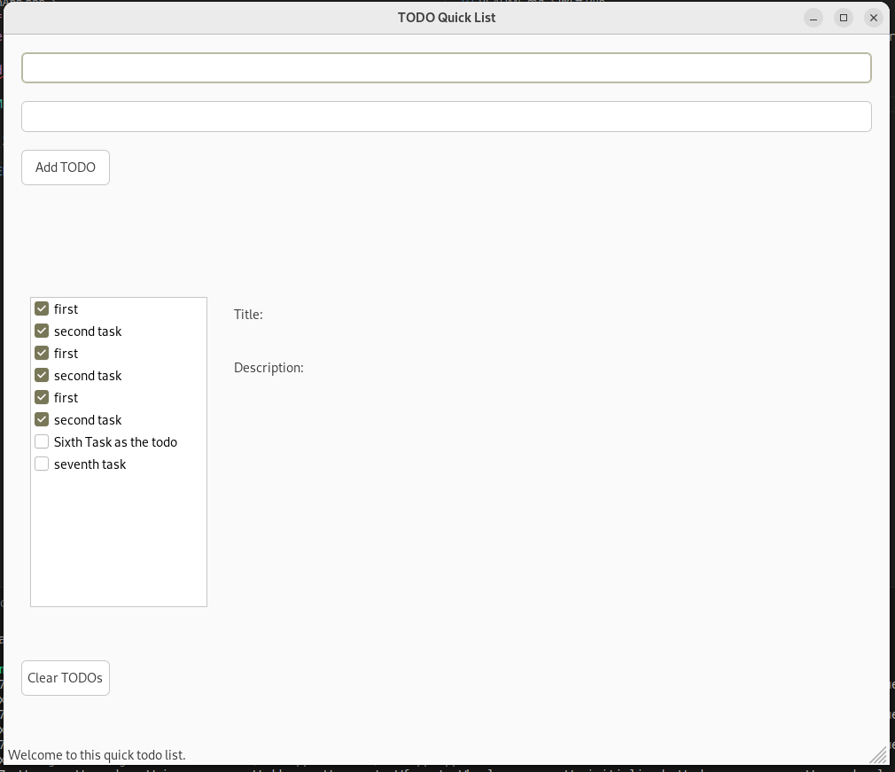
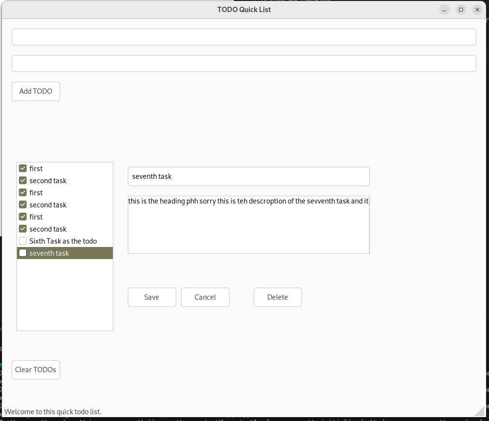

# quick_list
A quick todo list where you can create a task as a reminder for yourself built with wxWidgets and Cpp.
Initial idea is based on the c++ GUI Programming for Beginners from OttoBotCode video series
Added more functions on top of that initial idea, 

# Run
add run.sh into executable by chmod
and then run this executable file 
or
run make
and then run the program from build folder

# Screenshot
1. MainGUI of the Program 
2. Basic Update Window 